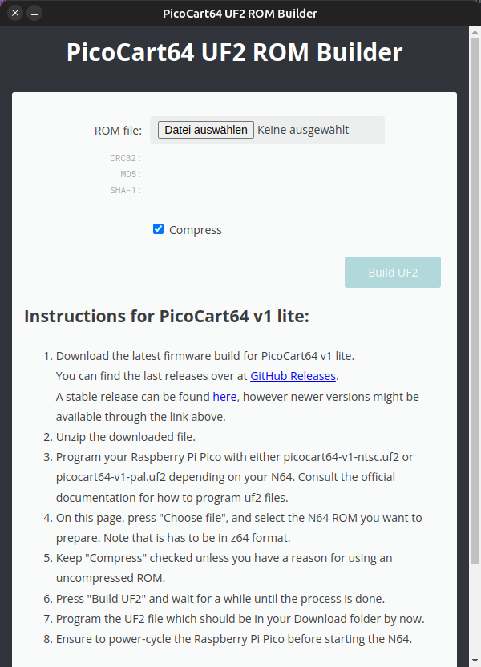

# *.n64 to *.uf2 converter
This is a electron wrapper that starts Konrad Beckmanns *.n64 to *.uf2 converter web page. 
[https://kbeckmann.github.io/PicoCart64/](https://kbeckmann.github.io/PicoCart64/)

The purpose of this application is to allow converasion even if the webpage is gone.

Its a simple electron wrapper.

# Screenshot

